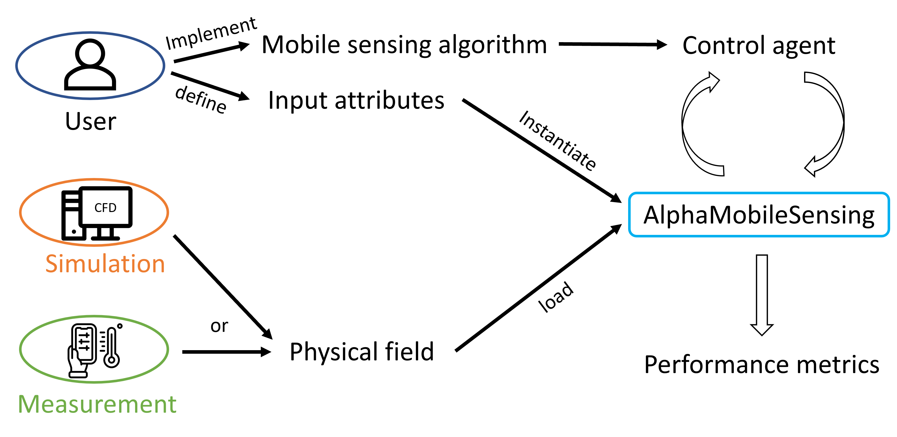

# AlphaMobileSensing
 This is an official repository of AlphaMobileSensing, an innovative virtual testbed for developing, testing, and benchmarking mobile sensing algorithms. 
 Please refer to the following paper for a detailed introduction of AlphaMobileSensing:
 > *Zhou, Q., Zhong, H., Li, L. and Wang, Z., 2023. AlphaMobileSensing: A virtual testbed for mobile environmental monitoring. Building Simulation*
 [[paper]](https://doi.org/10.1007/s12273-023-1001-9)
 
 AlphaMobileSensing keeps updating contineously. The new version (version 2) is now available.
 The work demonstrated in the paper was based on AlphaMobileSensing version 1 (v1). To reproduce the work in the paper, please use files with the suffix 'v1'.

# Overview
Environmental monitoring plays a critical role in creating and maintaining a comfortable, productive, and healthy environment. Built upon the advancements of robotics and data processing, mobile sensing demonstrates its potential to address problems regarding cost, deployment, and resolution that stationary monitoring encounters, which therefore has attracted increasing research attentions recently.
However, developing and testing those algorithms in the real world is expensive, challenging, and time-consuming. To address these issues, we proposed and implemented an open-source virtual testbed, AlphaMobileSensing, that can be used to develop, test, and benchmark mobile sensing algorithms.
For versatility and flexibility, AlphaMobileSensing was wrapped up using the standardized interface of OpenAI Gym, and it also provides an interface for loading physical fields that were generated by numerical simulations as virtual test sites to perform mobile sensing and retrieving monitoring data.

# Workflow
To help users understand the simulation process, we demonstrated a flowchart as belows. 

The virtual environment loads an input file that contains physical field information for the mobile agent to sense. The physical field information can be obtained via numerical simulations or field measurements, which could depend on the data availability and research objective. Next, the user is required to input the parameter values to initialize an instance of the virtual environment AlphaMobileSensing. These parameters include the attributes of the physical field, control agent, and the virtual environment. Mobile sensing algorithm that needs testing or evaluation can be implemented in a separate file, which is then imported into AlphaMobileSensing for the control agent to interface with the physical field. The simulation will keep running until a termination signal (e.g., reach the maximum simulation step) is received. As the simulation terminates, the user can request a performance evaluation on the algorithm. The virtual environment will compute a performance metrics and return it to the user. Based on the performance evaluation result, the user can choose to revise the algorithm and repeat the simulation process or finish the test.

The architecture of AlphaMobileSensing is shown as belows. We defined AlphaMobileSensing as a custom OpenAI Gym environment by inheriting a standard Gym class and created further methods to realize different functionalities. Both public and private methods were created in the environment. In addition, we defined several input attributes that
require assigning values when the virtual environment is instantiated. It is highly flexible for users to assign parameter values for different test scenarios.

# Release notes

version 2.0 (Feb 2023)
New Features:
- Add a functionality of stationary sensing (def stationary_sensing())
- Add an evaluation metrics Mean Absolute Error
- Support mobile sensing with multiple robots

version 1.0 (Jul 2022)

# Feedback

If you have any feedback, feel free to contact: [Qi Zhou](mailto:qizhou@ust.hk) or [Zhe Wang](mailto:cezhewang@ust.hk)

